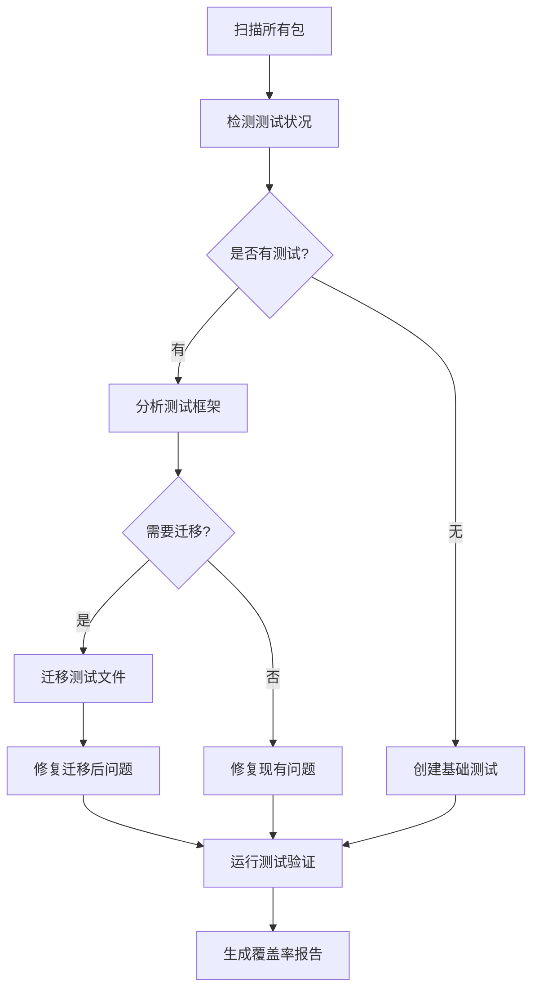

# 设计文档

## 概述

本设计文档描述了Pofresh项目测试迁移和完善的实施方案。该方案将直接修改现有测试文件，从旧的mocha+should.js框架迁移到现代的vitest框架，修复测试bug，并为缺少测试的包创建基础测试文件。

## 架构

### 实施流程图



### 核心操作

1. **包扫描**: 遍历packages/和plugin/目录
2. **测试检测**: 检查test目录和测试文件
3. **代码迁移**: 直接修改测试文件内容
4. **问题修复**: 修复语法和导入问题
5. **测试创建**: 为缺少测试的包创建.test.js文件
6. **验证运行**: 确保所有测试通过
7. **报告生成**: 输出迁移和覆盖率报告

## 实施方法

### 代码转换规则

#### Should.js 到 Expect 转换

```javascript
// 转换规则示例
const transformations = {
  // 基本断言
  'should.exist(value)' → 'expect(value).toBeDefined()',
  'should.not.exist(value)' → 'expect(value).toBeUndefined()',
  'value.should.equal(expected)' → 'expect(value).toBe(expected)',
  'value.should.not.equal(expected)' → 'expect(value).not.toBe(expected)',
  'value.should.be.true' → 'expect(value).toBe(true)',
  'value.should.be.false' → 'expect(value).toBe(false)',
  
  // 数组和对象
  'array.should.containEql(item)' → 'expect(array).toContain(item)',
  'obj.should.eql(expected)' → 'expect(obj).toEqual(expected)',
  'array.length.should.equal(n)' → 'expect(array).toHaveLength(n)',
  
  // 类型检查
  'value.should.be.a(type)' → 'expect(typeof value).toBe(type)',
  'value.should.be.an(type)' → 'expect(typeof value).toBe(type)'
};
```

#### 异步测试转换

```javascript
// 从回调模式转换为 async/await
// 原始代码
it('should do something', function(done) {
  someAsyncFunction(function(err, result) {
    should.not.exist(err);
    result.should.equal('expected');
    done();
  });
});

// 转换后
it('should do something', async () => {
  const result = await someAsyncFunction();
  expect(result).toBe('expected');
});
```

### 文件操作策略

#### 测试文件重命名

- 将 `test/xxx.js` 重命名为 `test/xxx.test.js`
- 保持目录结构不变
- 更新 vitest 配置以匹配新的文件模式

#### 导入语句修复

```javascript
// 移除 should.js 导入
- const should = require('should');

// 确保使用正确的模块导入
- const module = require('../lib/module');
+ import module from '../lib/module.js';
```

## 测试文件创建模板

### 基础测试模板

```javascript
// 为没有测试的包创建基础测试文件
// packages/package-name/test/index.test.js
import { describe, it, expect } from 'vitest';
import packageName from '../index.js';

describe('PackageName', () => {
  it('should export main functionality', () => {
    expect(packageName).toBeDefined();
  });

  it('should have correct API structure', () => {
    // 基于包的导出内容生成测试
  });
});
```

### API测试模板

```javascript
// 为包的主要API生成测试
describe('API Methods', () => {
  it('should handle valid input', () => {
    // 测试正常情况
  });

  it('should handle invalid input', () => {
    // 测试错误情况
  });

  it('should handle edge cases', () => {
    // 测试边界条件
  });
});
```

## 错误处理

### 常见问题和解决方案

1. **文件系统错误**: 检查文件权限，确保可读写
2. **语法转换失败**: 记录无法自动转换的文件，提供手动修改建议
3. **测试运行失败**: 分析错误日志，修复导入路径和语法问题
4. **异步测试问题**: 将回调模式转换为Promise或async/await
5. **模块导入问题**: 更新require语句为import语句

### 错误日志记录

- 为每个包创建迁移日志文件
- 记录成功迁移的文件列表
- 记录需要手动处理的问题
- 提供修复建议和参考链接

## 配置管理

### Vitest配置优化

```javascript
// vitest.config.js 增强配置
export default defineConfig({
  test: {
    globals: true,
    environment: 'node',
    include: [
      'test/**/*.{test,spec}.js',
      'packages/*/test/**/*.{test,spec}.js',
      'plugin/*/test/**/*.{test,spec}.js'
    ],
    exclude: [
      'node_modules/**',
      'dist/**',
      'coverage/**',
      '**/fixtures/**'
    ],
    coverage: {
      provider: 'v8',
      reporter: ['text', 'json', 'html', 'lcov'],
      include: [
        'packages/*/lib/**/*.js',
        'plugin/*/lib/**/*.js'
      ],
      exclude: [
        'test/**',
        '**/*.{test,spec}.js',
        '**/fixtures/**',
        '**/templates/**'
      ],
      thresholds: {
        global: {
          branches: 80,
          functions: 80,
          lines: 80,
          statements: 80
        }
      }
    },
    testTimeout: 10000,
    hookTimeout: 10000
  }
});
```

### 包级别配置

每个包都应该有自己的测试命令和配置：

#### 包的package.json配置

```json
{
  "name": "package-name",
  "scripts": {
    "test": "vitest",
    "test:watch": "vitest --watch",
    "test:coverage": "vitest --coverage"
  }
}
```

#### 包特定的vitest配置

```javascript
// packages/package-name/vitest.config.js
import { defineConfig } from 'vitest/config';

export default defineConfig({
  test: {
    globals: true,
    environment: 'node',
    include: ['test/**/*.{test,spec}.js'],
    exclude: ['node_modules/**', 'dist/**'],
    coverage: {
      provider: 'v8',
      reporter: ['text', 'json', 'html'],
      include: ['lib/**/*.js'],
      exclude: ['test/**']
    }
  }
});
```

## 实施步骤

### 第一阶段：扫描和分析

1. 扫描所有packages/和plugin/目录下的包
2. 检测每个包是否存在test目录
3. 分析现有测试文件使用的框架和语法
4. 生成包测试状况报告

### 第二阶段：迁移现有测试

1. 重命名测试文件为.test.js后缀
2. 转换should.js断言为expect语法
3. 修复导入语句和模块引用
4. 处理异步测试的回调转换
5. 移除旧的测试依赖

### 第三阶段：创建缺失测试

1. 为没有测试的包创建基础测试文件
2. 分析包的主要导出和API
3. 生成基本的功能测试用例
4. 添加错误处理和边界条件测试

### 第四阶段：验证和优化

1. 运行所有测试确保通过
2. 生成测试覆盖率报告
3. 修复发现的问题和bug
4. 优化测试性能和可靠性

## 预期结果

- 所有包都有符合vitest规范的测试文件
- 测试覆盖率达到80%以上
- 所有测试能够正常运行并通过
- 统一的测试框架和代码风格
- 完整的测试报告和文档